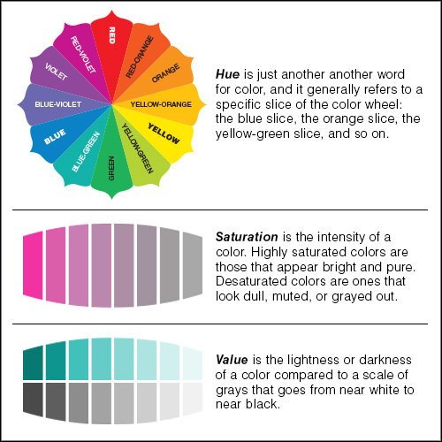
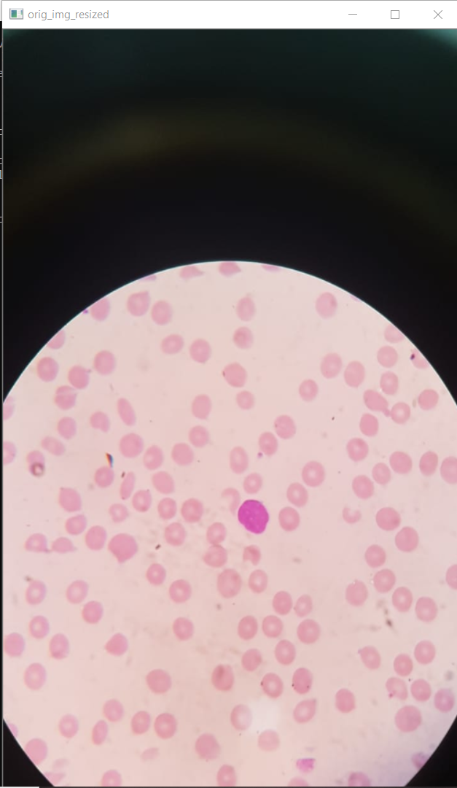
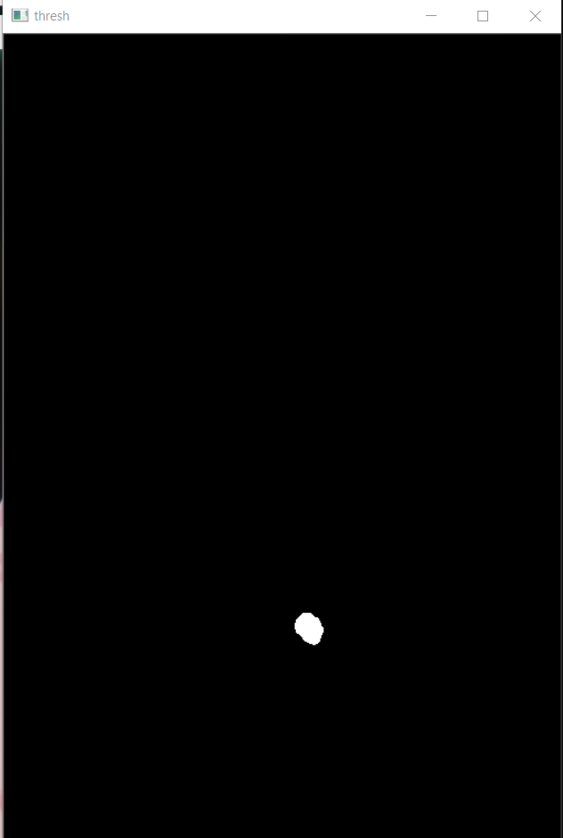
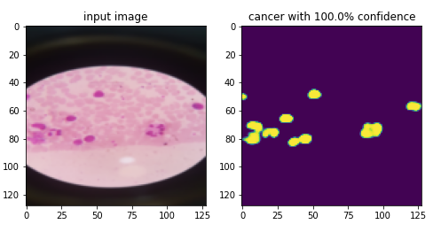
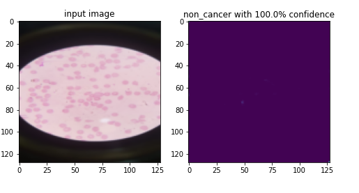

## Cancer cell segmentation of microscopic images with heuristic based weak supervision labelling

### Purpose: Deep dive on CNN Semantic segmentation and automated labelling using image processing
<br>
<b>Note:</b> If you face 'The notebook took too long to render' error while opening 'cancer_detection_segmentation_and_classification.ipynb' file, refer

##### [cancer_detection_segmentation_and_classification.ipynb](https://nbviewer.org/github/Shreesha3112/cancer-detection-and-segmentation/blob/main/cancer_detection_segmentation_and_classification.ipynb)

### Datatset Creation:

#### [Original cancer and non cancer biomedical images](https://drive.google.com/drive/folders/1fDrSDqt6Khst6M25GXiI0E2P06-h8WgB?usp=sharing)

<b>Data Augmentation</b><br>

For Cancer images below augmentation applied:<br>
* image rotation
* Horizontal flip
* Vertical flip
* Shift image height
* Shift image width
* Zoom image
* shear image - slant image by some angle clockwise or anti clockwise

For non cancer images beow augmentation applied<br>

* image rotation
* Horizontal flip
* Vertical flip

The imbalance in data is used to avoid overfitting model to non cancer images, during segmentation<br>

[Keras ImageDataGenerator](https://www.tensorflow.org/api_docs/python/tf/keras/preprocessing/image/ImageDataGenerator) is used to apply augmentation and generate dataset.

---

#### Automated Segmentation label generation using image processing

##### Heuristic algorithm steps

* Apply GaussianBlur
    * Gaussian blur smoothes uneven pixel values in an image by cutting out the extreme outliers
* Detect a Cancer cell based on the range of pixel values in the HSV colorspace
    * convert blurred frame from BGR(Blue,green,red) to HSV(Hue,Saturation,Value)
    * Set the lower and upper bound of HSV. You can get the lower and upper bound using <b>[HSV tracker](https://github.com/Shreesha3112/Cancer-Detection-Segmentation-and-Classification/blob/main/hsv_color_tracker.py)</b><br>
        Lower bound = (Lower hue,lower saturation,lower value)<br>
        Upper bound = (upper hue,upper saturation,upper value)
    * Detect object using range of lower and upper HSV bounds<br>
    <br>
    <div style="text-align:center"></div><br>
* Apply Morphological transformation.
    * Operation:Opening - Erosion followed by dilation. Useful for removing noise
    * Erosion - It is useful for removing small white noises based on kernel size.It also shrinks the mask area.
    * Dilation - Increase area of the mask after erosion.
* Apply Otsu's Binarization
    * Binarization converts every pixel to white or black based on the given threshold. It also smoothens the edges
    * Otsu's method avoids having to choose a threshold value and determines it automatically

<br>
<table border="none">
  <tr>
    <td>Cancer cell sample</td>
     <td>Generated label</td>
     <td>bitwise AND between original image and generated label</td>
     <td>Show result on original image</td>
  </tr>
  <tr>
    <td></td>
    <td></td>
    <td></td>
     <td></td>
  </tr>
 </table>
 
---

### Modelling

##### [U-net model](https://arxiv.org/abs/1505.04597)

* U-net model was originally ivented and first used for biomedical image segmentation. Suitable for tasks like cancer segmentation
* I am using modified version of U-net model by changing model hyperparameters such as activation function and kernel initializer 
* Architecture is also modified to suit input of (128,128,3).


---

### Model Hyperparamters

All Conv2D convolutional layers have following parameters:

* <b>Activation = 'Elu' (Exponential Linear Unit)</b>. Faster and higher accuracies for classification tasks compared to usual 'Relu'(Rectified Linear activation) function. Elu also mitigates the need for batch normalization when working on homogenous dataset(low data drift impact) which saves computation time.<br>
  <b>[Tensorflow ELU](https://www.tensorflow.org/api_docs/python/tf/keras/layers/ELU)</b><br>
  <b>[ELU paper](https://arxiv.org/abs/1511.07289)</b>


* <b>Kernel intializer = 'He_normal'</b>. Works well for deep neural networks by avoiding vanishing or exploding gradient problem.It does so, by ensuring the weights of each layer is intialized based on the depth of NN and size of hidden layer.<br>
  <b>[Tensorflow he_normal](https://www.tensorflow.org/api_docs/python/tf/keras/initializers/he_normal)</b><br>
  <b>[he_normal paper](https://www.cv-foundation.org/openaccess/content_iccv_2015/html/He_Delving_Deep_into_ICCV_2015_paper.html)</b>

* <b>filter size : (3,3)</b>. Reduction of the filter size provides both an increase in performance, a shorter time to reach success and a shorter duration of the process as a result of the low filter size<br>
  <b>[Analysis of Filter Size Effect In Deep Learning](https://arxiv.org/pdf/2101.01115)</b>
* <b>pading = 'same'</b>. Ensures feature map will have same size as input. Ensures importances of edges of the image during convolution operation.

* <b>stride = 1</b>. Filter movement set to 1 unit at a time.

<br>

All Conv2DTranspose layers have following parameters:
<b>Transpose convolution layer</b> is combination of upsampling and convolution operation except instead of manual selection of upsampling technique(nearest-neighbour for example), model itself will determine best way to perform upsampling.
* <b>No activation applied</b>: Transpose convolution layers are used for reconstruction only in our model. Non linear activation applied in seperate convolutional layers.
* <b>filter size : (2,2)</b>
* <b>Stride = (2,2)</b>. Stride in transpose convolution behaves opposite to stride in convolution layer
* <b>padding = same</b> 

---

 ### Segmentation evaluation metrics

Segmentation evaluation is done by matching each pixel of Ground truth mask to the predicted mask

Usual Segmentation evaluation metrics are , Dice coeffecient , Intersection Over Union and pixel accuracy.


Note:

* TP = Number of pixels correctly identified as part cancer cells.
* TN = Number of pixels correctly identified as part of non - cancerous.
* FP = Number of pixels incorrectly identified as part of cancer cells.
* FN = Number of pixels incorrectly identified as part of non - cancerous.


**Pixel accuracy**: 
```
Pixel accuracy = (TP + TN) / (TP + TN + FP + FN)
```
Pixel accuracy is highly biased evaluation for cancer detection. Accuracy could be more than 90% even if 0 cancer cells segmented.


**Dice coeffecient / F1 score**:


<p align="center"></p>


Dice coeffecient penalises instnces of bad classification unlike Pixel accuracy

<b>[Dice Coeffecient](https://en.wikipedia.org/wiki/S%C3%B8rensen%E2%80%93Dice_coefficient)</b>


<b>Note:</b><br> 
Dice coffecient has disdavntages. It overstates the importance of sets with little-to-no actual ground truth positive sets. In the common example of image segmentation, if an image only has a single pixel of some detectable class, and the classifier detects that pixel and one other pixel, its F score is a lowly 2/3 and the IoU is even worse at 1/2. Trivial mistakes like these can seriously dominate the average score taken over a set of images. In short, it weights each pixel error inversely proportionally to the size of the selected/relevant set rather than treating them equally.
<br><br>


---

### Training

##### Segmentation ouput is tracked using keras callbacks throughout the training

* Sample prediction after epoch 1

<figure></figure>

* Sample prediction after epoch 3

<figure></figure>

* Sample prediction after epoch 5

<figure></figure>

* Sample prediction after epoch 10

<figure></figure>

* Sample prediction after epoch 25

<figure></figure>

* Sample prediction after epoch 50

<figure></figure>

* Sample prediction after epoch 97

<figure></figure>


[Click to see complete sample predictions after each epoch](https://github.com/Shreesha3112/Cancer-Detection-Segmentation-and-Classification/tree/main/output%20after%20each%20epoch)

---

##### Intermediate layer output of trained model

* Input layer
<figure></figure>

* Convolution layer
<figure></figure>

* Max pooling layer
<figure></figure>

* Transpose convolution layer
<figure></figure>

* Concatenate
<figure></figure>

* Final convolution layer
<figure></figure>

* Final output
<figure></figure>

[Click to see output of all layers](https://github.com/Shreesha3112/Cancer-Detection-Segmentation-and-Classification/tree/main/output%20after%20each%20layer)

---

### Performance

<figure></figure>

<figure></figure>

---

### Final predictions

<figure></figure>

<figure></figure>

[Click to see all predictions](https://github.com/Shreesha3112/Cancer-Detection-Segmentation-and-Classification/tree/main/predictions)
